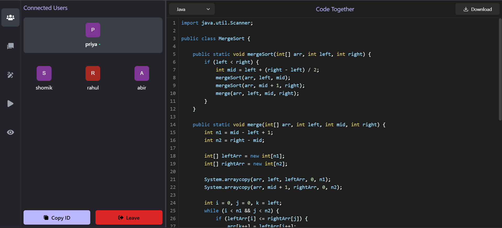
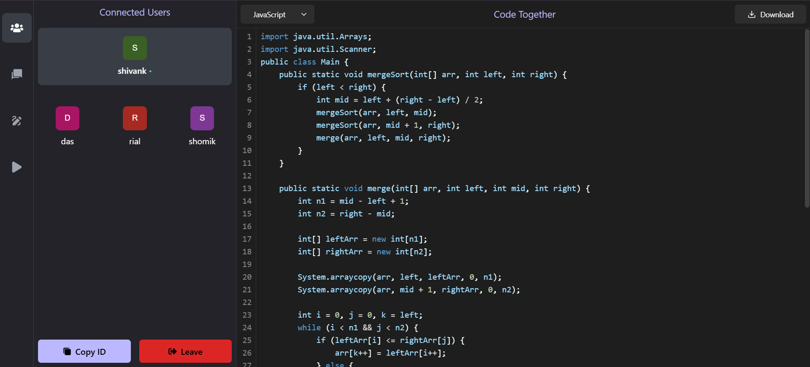
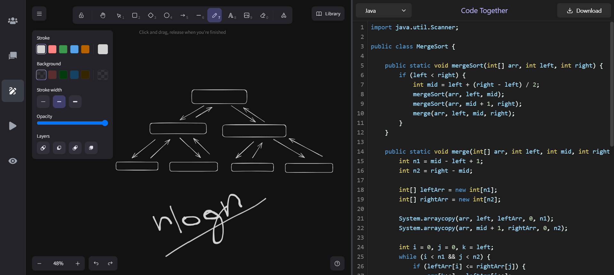
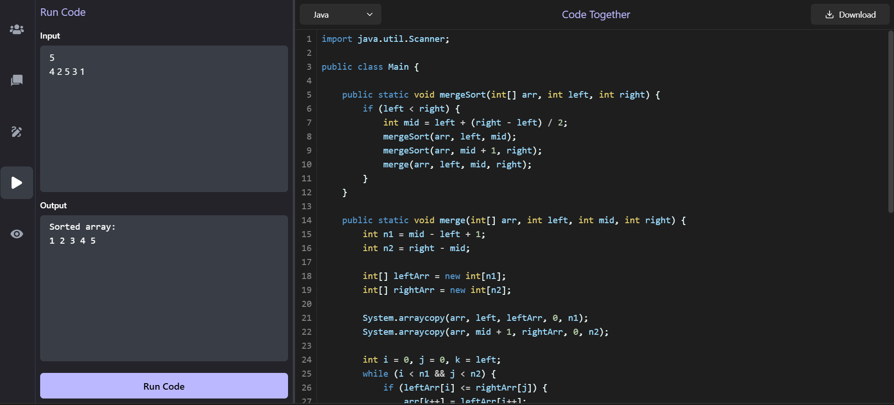
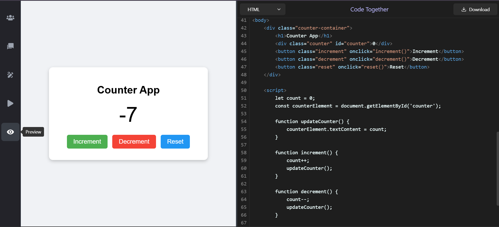

# CodeTogether 🚀

> A real-time collaborative code editor that enables developers to code, communicate, and collaborate together in one shared workspace.

CodeTogether is a full-stack collaborative coding platform where multiple users can join a unique room, edit code in real time, communicate through chat and calls, and execute code together.

## ✨ Features

- 🔐 **Authentication** — User sign up and login functionality
- 🏠 **Unique Rooms** — Create and join collaborative coding rooms
- ⚡ **Real-Time Code Editing** — Multiple users can edit the same code simultaneously
- 🎨 **Syntax Highlighting & Auto Suggestions** — Improved coding experience
- 💬 **Live Group Chat** — Communicate with other users inside the room
- ▶️ **Code Execution** — Execute code directly from the collaborative editor
- 📹 **Real-Time Group Video Calls** — Communicate with other participants through live video calls
- 📜 **Room History** — View previously created or joined rooms
- 🌐 **Live Deployment** — Accessible through a public web application

## 🖥️ Screenshots

### Collaborative Coding Environment



### Real-Time Collaboration



### Group Communication



### Code Execution



### Collaborative Workspace



## 🛠️ Tech Stack

### Frontend
- React.js
- JavaScript
- HTML5
- CSS3

### Backend
- Node.js
- Express.js

### Database
- MongoDB
- MongoDB Atlas

### Real-Time Communication
- Socket.IO
- Agora

### Deployment
- Render

## 🏗️ Project Structure

```text
CodeTogether/
├── client/     # React frontend
├── server/     # Node.js + Express backend
├── Photos/     # Project screenshots
└── README.md
